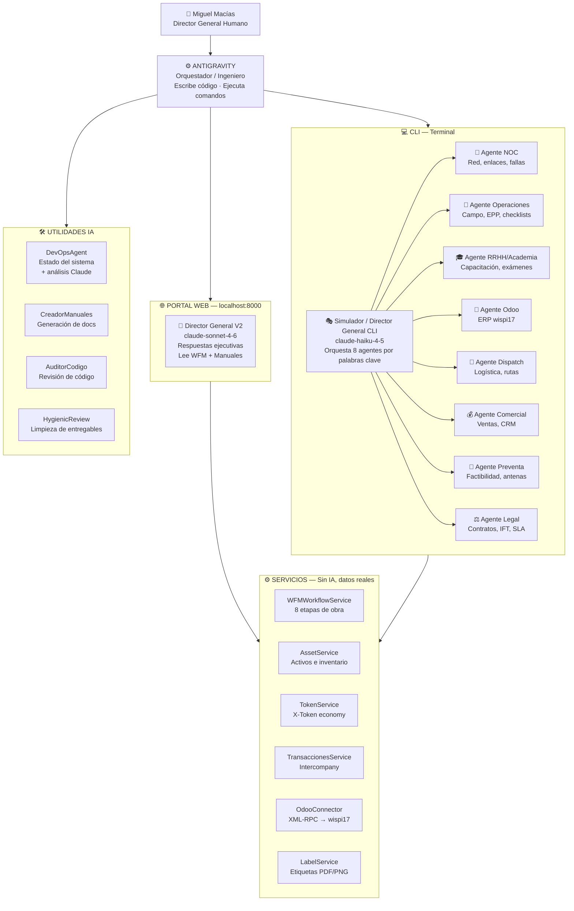

# 🤖 GUÍA DE AGENTES XCIEN 2026
> **Documento operativo** · Antigravity · Mayo 2026  
> Basado en ejecución real verificada el 2026-05-15

---

## 1. ¿QUÉ ES UN AGENTE EN XCIEN?

Un **agente** es un programa Python que recibe una instrucción, la procesa (con IA o lógica propia) y devuelve un resultado concreto. No son chatbots genéricos — cada uno tiene un **rol empresarial específico** dentro de XCIEN.

Hay tres tipos:

| Tipo | Descripción | Ejemplo |
|---|---|---|
| **Agente IA** | Usa Claude (Anthropic) para razonar y responder | `director_general_v2.py` |
| **Agente Operativo** | Lógica de negocio sin IA, trabaja con datos reales | `wfm_workflow_service.py` |
| **Agente Stub** | Estructura lista, pendiente de implementación | `agent_noc.py` |

---

## 2. DIAGRAMA DEL ECOSISTEMA



---

## 3. GUÍA DE CADA AGENTE

### 🧠 DIRECTOR GENERAL V2 — `director_general_v2.py`
**Contexto:** Portal web · `http://localhost:8000`  
**Modelo:** `claude-sonnet-4-6`  
**¿Qué hace?** Es el cerebro del portal. Responde preguntas ejecutivas con datos reales de WFM (tickets, técnicos) y el Libro Maestro de Operaciones.

**Cómo se activa:**
```bash
# Automáticamente cuando arranca el servidor
python3 backend/servidor_academia.py

# O directo vía API:
curl -X POST http://localhost:8000/api/director/chat \
  -H "Content-Type: application/json" \
  -d '{"message": "dame el estado de los tickets", "history": []}'
```

**Cuándo usarlo:** Cuando necesitas información ejecutiva, estado de operaciones, análisis de tickets, recomendaciones de asignación.

---

### 🎭 SIMULADOR DE AGENTES — `simulador_agentes.py`
**Contexto:** CLI · Terminal  
**Modelo:** `claude-haiku-4-5-20251001` (8 agentes en paralelo)  
**¿Qué hace?** El Director General CLI recibe una instrucción y la **delega automáticamente** al agente correcto según palabras clave.

**Cómo se activa:**
```bash
cd /Users/mesquite/Antigravity/backend/agents
python3 simulador_agentes.py
```

**Tabla de routing automático:**

| Palabras clave en tu mensaje | Agente que responde |
|---|---|
| `caído`, `enlace`, `noc`, `red`, `falla`, `monitoreo` | 📡 Agente NOC |
| `campo`, `EPP`, `instalación`, `técnico`, `seguridad` | 🔧 Agente Operaciones |
| `capacitación`, `curso`, `academia`, `examen`, `manual` | 🎓 Agente RRHH/Academia |
| `odoo`, `erp`, `módulo`, `ticket`, `registro` | 💼 Agente Odoo |
| `asignar`, `ruta`, `despacho`, `agenda`, `dispatch` | 🚚 Agente Dispatch |
| `venta`, `comercial`, `cotización`, `prospecto`, `cliente` | 💰 Agente Comercial |
| `factibilidad`, `preventa`, `coordenadas`, `antena`, `señal` | 📐 Agente Preventa |
| `contrato`, `legal`, `IFT`, `arrendamiento`, `SLA`, `cláusula` | ⚖️ Agente Legal |

---

### ⚙️ WFM WORKFLOW SERVICE — `wfm_workflow_service.py`
**Contexto:** Servicio backend · Se usa vía API REST  
**¿Qué hace?** Motor del ciclo completo de una obra de instalación. Gestiona las **8 etapas** de cada orden de trabajo.

**Flujo de una orden WFM:**
```
1. Solicitud Comercial  →  Cliente pide servicio
2. Preventa             →  Análisis de factibilidad técnica
3. Contratación         →  Firma y aprobación
4. Almacén              →  Solicitud de equipos
5. Aprovisionamiento    →  Configuración de red/IP/VLAN
6. Instalación          →  Técnico en campo con evidencias
7. NOC Alta             →  Alta en sistema de monitoreo
8. Cierre               →  Entrega al cliente + firma
```

**Endpoints REST disponibles:**
```
GET  /api/wfm/tickets           → lista todos los tickets
GET  /api/wfm/tecnicos          → lista técnicos disponibles
POST /api/wfm/asignar/{id}      → auto-asigna el mejor técnico
POST /api/wfm/workflow/crear    → crea nueva orden
POST /api/wfm/workflow/{id}/preventa  → actualiza preventa
POST /api/wfm/workflow/{id}/instalar  → registra instalación con evidencias
```

---

### 🛠️ DEVOPS AGENT — `devops_agent.py`
**Contexto:** CLI o API  
**Modelo:** `claude-sonnet-4-6`  
**¿Qué hace?** Revisa el estado real del sistema (Git, PM2, Odoo, métricas del servidor) y lo analiza con Claude.

**Cómo se activa:**
```bash
cd /Users/mesquite/Antigravity/backend/agents
python3 devops_agent.py
```

**Cuándo usarlo:** Cuando algo falla en producción y necesitas diagnóstico rápido del sistema.

---

### 📝 CREADOR DE MANUALES — `creador_manuales.py`
**Contexto:** CLI  
**Modelo:** `claude-sonnet-4-6`  
**¿Qué hace?** Genera manuales técnicos en formato Markdown listos para la Biblioteca del portal.

**Cómo se activa:**
```bash
cd /Users/mesquite/Antigravity/backend/agents
python3 creador_manuales.py
```

---

### 🔍 AUDITOR DE CÓDIGO — `auditor_codigo.py`
**Contexto:** CLI  
**Modelo:** `claude-sonnet-4-6`  
**¿Qué hace?** Revisa archivos de código buscando: higiene, seguridad y arquitectura.

**Cómo se activa:**
```bash
cd /Users/mesquite/Antigravity

# Auditar un archivo específico:
python3 auditor_codigo.py --file backend/agents/director_general_v2.py

# Listar todos los archivos auditables:
python3 auditor_codigo.py --list

# Auditoría global de estructura:
python3 auditor_codigo.py --full
```

---

### 🌉 PUENTE (BRIDGE) — `puente.py`
**Contexto:** CLI · Requiere backend activo en `:8000`  
**¿Qué hace?** Permite a cualquier proceso externo reportar su estado al dashboard del portal en tiempo real.

**Cómo se activa:**
```bash
# Ver estado actual del puente:
python3 puente.py --query

# Actualizar tarea en el dashboard:
python3 puente.py --task "Generando reporte mensual" --status working

# Agregar entrada al log:
python3 puente.py --log "Conexión con Odoo establecida"
```

---

### 💰 TOKEN SERVICE — `token_service.py`
**Contexto:** Servicio importado por el backend  
**¿Qué hace?** Emite y verifica X-Tokens (economía interna de XCIEN). Cada token representa una transacción validada (oportunidad ganada, movimiento de RRHH, etc.).

**Uso vía API:**
```
POST /api/tokens/emitir      → emite token de oportunidad
POST /api/tokens/operativo   → emite token de RRHH (alta, baja, movimiento)
GET  /api/tokens/listar      → lista todos los tokens
GET  /api/tokens/{id}        → verifica firma de un token
```

---

### 📦 ASSET SERVICE — `asset_service.py`
**Contexto:** Servicio importado por el backend  
**¿Qué hace?** Controla el ciclo de vida de activos físicos: antenas, switches, cables, equipos de campo.

**Uso vía API:**
```
POST /api/activos/registrar   → registra nuevo activo
GET  /api/activos/listar      → lista activos por empresa/site
POST /api/activos/{id}/mover  → transfiere activo a otro site
GET  /api/activos/{id}/label  → genera etiqueta QR del activo
```

---

## 4. CÓMO ARRANCAR TODO

```bash
# 1. Ir al directorio raíz
cd /Users/mesquite/Antigravity

# 2. Limpiar puerto si es necesario
lsof -ti :8000 | xargs kill -9 2>/dev/null

# 3. Activar entorno virtual
source .venv/bin/activate

# 4. Arrancar el backend completo
python3 backend/servidor_academia.py

# 5. Portal disponible en:
#    http://localhost:8000
```

**Para usar el Simulador CLI (8 agentes) en otra terminal:**
```bash
cd /Users/mesquite/Antigravity/backend/agents
source ../../.venv/bin/activate
python3 simulador_agentes.py
```

---

## 5. ESTADO REAL DE LOS AGENTES (verificado 2026-05-15)

| Agente | Estado | Modelo | Contexto |
|---|---|---|---|
| `director_general_v2` | ✅ **OPERATIVO** | claude-sonnet-4-6 | Portal :8000 |
| `simulador_agentes` (8 sub-agentes) | ✅ **OPERATIVO** | claude-haiku-4-5 | CLI |
| `devops_agent` | ✅ **LISTO** | claude-sonnet-4-6 | CLI |
| `creador_manuales` | ✅ **LISTO** | claude-sonnet-4-6 | CLI |
| `auditor_codigo` | ✅ **LISTO** | claude-sonnet-4-6 | CLI |
| `wfm_workflow_service` | ✅ **OPERATIVO** | — (Odoo+JSON) | API :8000 |
| `asset_service` | ✅ **OPERATIVO** | — | API :8000 |
| `token_service` | ✅ **OPERATIVO** | — | API :8000 |
| `transacciones_service` | ✅ **OPERATIVO** | — | API :8000 |
| `odoo_connector` | ✅ **OPERATIVO** | — (xmlrpc) | Servicio |
| `puente` | ⚠️ **CONDICIONAL** | — | Requiere :8000 |
| `telegram_bot` | ❌ **SIN TOKEN** | — | Pendiente config |
| `agent_noc/wfm/academia/etc.` | ⚠️ **STUBS** | — | Pendiente impl. |

---

## 6. REGLAS DE ORO

1. **No duplicar dashboards** — toda funcionalidad nueva va dentro de `Xcien2Page`
2. **Usar variables CSS** — nunca hex hardcodeado; usar `var(--xcien-accent)`
3. **El Hub Principal (`/`) es sagrado** — no se elimina
4. **`ESTADO_SISTEMA.md` es la fuente de verdad** — actualizarlo en cada cambio mayor
5. **Antigravity** es el ingeniero — escribe y repara código, no toma decisiones operativas
6. **DirectorGeneralV2** es el agente operativo — responde con datos reales del sistema

---

*Generado por Antigravity · XCIEN 2026*
