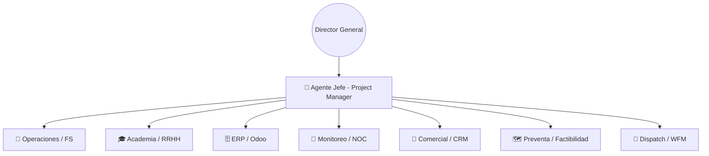

# 🤖 Gabinete de Agentes XCIEN 2.0
## Orquestación Inteligente y Profesionalización Operativa

---

### 🏛️ Estructura de Inteligencia
Xcien opera bajo un modelo de **Gobernanza Digital** donde un orquestador central coordina a especialistas para maximizar la eficiencia.

---

## 👥 Roles y Responsabilidades

### 🎯 Agente Jefe (Project Manager)
- **Función:** Cerebro del sistema. Analiza instrucciones y delega al agente correcto.
- **Output:** Respuesta coordinada y trazabilidad total del proyecto.

### 🔧 Agente de Operaciones (Field Service)
- **Función:** Supervisor de calidad y seguridad en campo.
- **Responsabilidades:**
  - Validar niveles de señal (Estándar: -35 a -45 dBi).
  - Auditar seguridad en alturas y uso de EPP.
  - **REGLA DE ORO:** Verificación de "Cero Basura" en cada sitio.

### 🎓 Agente de RRHH (Academia Digital)
- **Función:** Desarrollo y certificación del personal técnico.
- **Sistema 2026:** Evaluación por **5 Pilares Maestros** (Instalación, Soporte, Seguridad, Odoo/Admin, Atención).
- **Herramienta:** Generador de exámenes dinámicos con IA y Matriz de Habilidades.

### 🗄️ Agente de Odoo (ERP)
- **Función:** Integración total de la operación física con `wispi17`.
- **❗ CLÁUSULA CRÍTICA:** La documentación de tareas en Odoo es **OBLIGATORIA**. 
- Todo ticket debe incluir evidencia fotográfica y registro exacto de materiales consumidos para su cierre.

### 📡 Agente de NOC (Network Operations Center)
- **Función:** Centinela de la salud de red y escalación técnica.
- **Flujo HL:** ATC → NOC (N1/N2) → FS (Soporte en sitio) → Ingeniería.

### 💼 Agente Comercial
- **Función:** Gestión de pipeline y CRM. Asegura que la preventa técnica respalde la venta.

### 🗺️ Agente de Preventa (Factibilidad)
- **Función:** Análisis de coordenadas y línea de vista (LV). Determina viabilidad técnica (Info OK/NOK).

### 🚚 Agente de Dispatch (WFM)
- **Función:** Optimización de la fuerza de trabajo y logística.
- **Sistema WFM:** Asignación inteligente por zona + nivel de skill basada en datos reales de técnicos en Odoo.
- **Gestión:** Rutas, agendas y despacho de materiales desde almacén.

---

## 📊 Sistema WFM (Dispatch Inteligente)
| Función | Integración Odoo |
|---|---|
| **Roster Real** | Sincronizado con recursos humanos en Odoo. |
| **Auto-Asignación** | Basado en el % de habilidad detectado en la Academia. |
| **KPIs de Campo** | Medición de tiempos de respuesta (SLA) y resolución (FCR). |

---

## 🎯 Objetivo de Profesionalización
**"Xcien 2.0: Operación Basada en Datos, Calidad Certificada e Higiene Total."**
