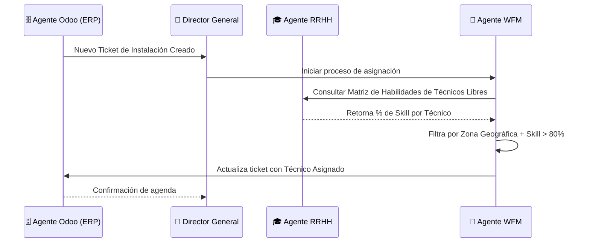
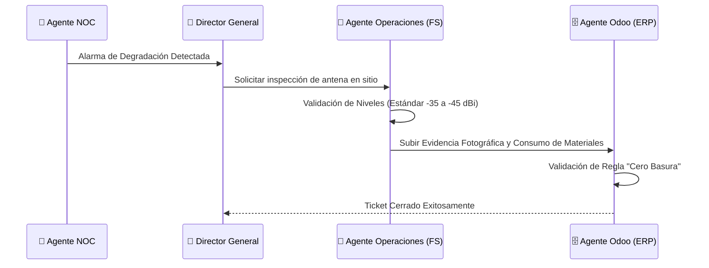
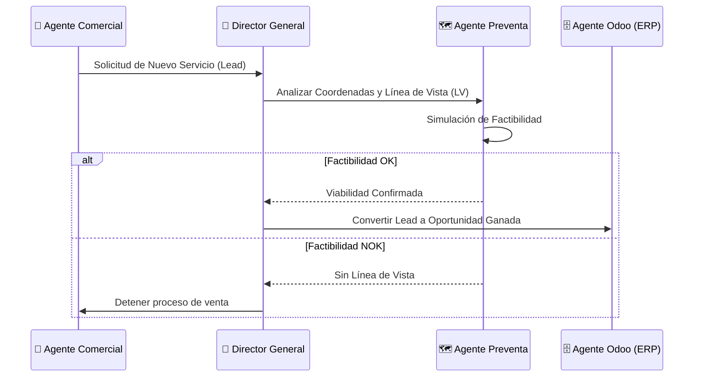

# Interacción de Agentes XCIEN 2.0
## Flujos Operativos y Orquestación

Este documento detalla cómo los diferentes Agentes de la plataforma XCIEN 2.0 interactúan entre sí para lograr una operación automatizada y profesional.

---

### 1. Flujo de Asignación Inteligente de Tickets
Este flujo involucra la colaboración entre **ERP (Odoo)**, **RRHH (Academia)** y **WFM (Dispatch)** para asegurar que cada ticket sea atendido por el técnico más capacitado disponible en la zona.

---

### 2. Flujo de Soporte y Escalación en Campo
Define el proceso de atención a incidentes desde el monitoreo de red hasta la ejecución en campo con soporte experto.

---

### 3. Flujo Comercial y Factibilidad Técnica
Asegura que todas las ventas estén respaldadas por viabilidad técnica antes de ser confirmadas y enviadas a campo.

---

## Principios de Orquestación

1. **Centralización en el Director General:** Ningún agente toma decisiones destructivas (como cerrar una venta sin factibilidad) sin pasar por el orquestador principal.
2. **La Verdad Reside en Odoo:** Toda transacción, evidencia y estado actual se sincroniza en Odoo. Es la base de datos maestra.
3. **Calidad por Diseño (Academia):** La certificación continua en los "5 Pilares Maestros" restringe automáticamente quién puede ser despachado a tickets complejos.
